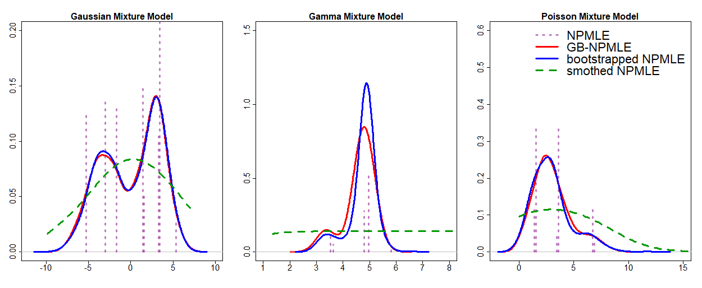

# GBnpmle
R pakcage for Generative Bootstrap NPMLE, _GB-NPMLE_ in short.

## Abstract 
Nonparametric maxium likelihood estimator (NPMLE) is popular for estiamting latent distribution in mixture model despite the fact that NPMLE is almost-surely discrete which is less attractive when truth is continous density. 

Bootstrapping is one of the nature way to introduce smoothness such as Weighted likelihood Bootstrap. GB-NPMLE is a generative framework for fast approximating true NPMLE bootstrap distribution with siginificant computational reduction while remain as smooth as true bootstrap esimator.

## Installation
To run the Net-NPMLE smoothly, there are several pre-requisites needed to be installed before the R package. The main of GB-NPMLE is worte in `Python`, especially __Pytorch__ library and we strongly recommend using `CUDA` (GPU-Based tool) to train Net-NPMLE which can be accelerated a lot than using `CPU`.
- __Python__ 3.7 or above
- __[Pytroch](https://pytorch.org/)__ 1.11.0 or above
- __[NAVID CUDA](https://developer.nvidia.com/cuda-toolkit)__ 10.2 or above


In R, we also need `reticulate` package to run `Python` in R and `devtools` to install R package from github.
```
install.package("reticulate")
install.package("devtools")
```

Now, use the following code to install `GBnpmle` package.
```
library(devtools)
install_github(repo = "shijiew97/GBnpmle")
library(GBnpmle)
```

## Main functions
There are three main functions in the `Net-GBnpmle` package, which are detailed specified below.
- `GB_NPMLE` aims to train the bootstrap generator via a novel two-stage algorithm. Currently GB-NPMLE supports mixutre cases such as Gaussian-location, Poisson-mixture, Lognormal-location, Gamma-rate and Binomial-prob.
- `GB_NPMLE_Sample` generates bootstrap samples using the trained generator from `GB_NPMLE`.
- `GB_NPMLE_Load` loads a pre-trained bootstrap generator for further training or generation procedure using object from `GB_NPMLE`.

## Illustration
For illustration of GB-NPMLE, we consider three mixture model cases of sample size $n=1,000$ descripted as below. 

Moreover, we also consider __classical NPMLE esimator__ (NPMLE), __smoothed NPMLE__ (sNPMLE) which is implemented by R package `REBayes` and classical __boostrapped NPMLE__, as comparison to __GB-NPMLE__.
  ```{r, eval=FALSE}
  gb_col <- rgb(1, 0, 0)
  bnp_col <- rgb(0, 0, 1)
  np_col <- rgb(0.5, 0, 0.5, 0.5)
  nps_col <- rgb(0, 0.6, 0)
  line_w <- 3
  np_res <- 1
  par(mfrow=c(1,3))
```

- Gaussian Mixture Model (GMM): $\mathbf{y} \vert \theta \sim \mathcal{N}(\theta, 1) \text{ and } \theta = 0.5\mathcal{N}(-3,2)+0.5\mathcal{N}(3,1)$
  
  ```{r, eval=FALSE}
    set.seed(2021)
    n <- 1000;theta <- rep(0, n)
    param <- matrix(rep(c(c(-3,2),c(3,1)), n/2), nrow=2)
    for(i in 1:n){theta[i]<-rnorm(1, param[1,i], param[2,i])}
    Y <- theta + rnorm(n);X <- rep(1,n)
    fit_gb <- GB_NPMLE(Y=Y, param=1, distribution="Gaussian location", num_it=1000, n=n, p=1, S=100, q=100, verb=1, hidden_size=500, M=100, N=100)
    sample_gb <- GB_NPMLE_Sample(fit_gb[[1]], boot_size=10000)
    f <- REBayes::GLmix(Y, v=100, sigma=1)
    fs <- REBayes::KWsmooth(f, bw=10)
    plot(density(sample_gb, adjust=1.5), cex.axis=1.85, lwd=line_w, col=gb_col, xlab='', ylab='', main='', xlim=c(-12, 10), ylim=c(0, 0.2))
    lines(density(gmm_np,adjust=1.5), col=bnp_col, lwd=line_w)
    title(main="Gaussian Mixture Model", line=0.5, cex.main=2, font.lab=1)
    lines(f$x, f$y, col=np_col, lwd=3, lty=3)
    lines(fs$x, fs$y, lwd=3, col=nps_col, lty=2)
  ```
- Gamma Mixture Model (GaMM): $\mathbf{y} \vert \theta \sim G\text{amma}(10,\theta)$ and $\theta \sim W\text{eibull}(10, 5)$
  ```{r, eval=FALSE}
    set.seed(2021)
    n <- 10000;ga_shape <- 10;X <- rep(1,n)
    theta <- rweibull(n, 10, 5);Y <- rgamma(n, rate=theta, shape=ga_shape)
    fit_gb <- GB_NPMLE(Y=Y, param=10, distribution="Gamma rate", num_it=2000, n=n, p=1, S=100, q=100, verb=1, hidden_size=500)
    sample_gb <- GB_NPMLE_Sample(fit_gb[[1]], boot_size=10000)
    f <- REBayes::Gammamix(Y, shape=ga_shape, v=100)
    fs <- REBayes::KWsmooth(f, bw=2)
    plot(density(sample_gb, adjust=5.0), cex.axis=1.85, lwd=line_w, col=gb_col, xlab='', ylab='', main='', xlim=c(-12, 10), ylim=c(0, 0.2))
    lines(density(1/gmm_np,adjust=5.0), col=bnp_col, lwd=line_w)
    title(main="Gamma Mixture Model", line=0.5, cex.main=2, font.lab=1)
    lines(f$x, f$y, col=np_col, lwd=3, lty=3)
    lines(fs$x, fs$y, lwd=3, col=nps_col, lty=2)
  ```
- Poisson Mixture model (PMM): $\mathbf{y}\vert\theta \sim P\text{oisson}(\theta) \text{ and }\theta \sim G\text{amma}(\text{3},\text{1})$
    ```{r, eval=FALSE}
    set.seed(2021)
    n <- 1000;theta <- rgamma(n,3,1);X <- rep(1,n);Y <- rpois(n, lambda=theta)
    fit_gb <- GB_NPMLE(Y=Y, param=10, distribution="Poisson", num_it=1000, n=n, p=1, S=100, q=100, verb=1, hidden_size=500)
    sample_gb <- GB_NPMLE_Sample(fit_gb[[1]], boot_size=10000)
    f <- REBayes::Pmix(Y, v=100, exposure=X, rtol=1e-10)
    fs <- REBayes::KWsmooth(f, bw=10)
    plot(density(sample_gb, adjust=2.0), cex.axis=1.85, lwd=line_w, col=gb_col, xlab='', ylab='', main='', xlim=c(-12, 10), ylim=c(0, 0.2))
    lines(density(gmm_np,adjust=2.0), col=bnp_col, lwd=line_w)
    title(main="Poisson Mixture Model", line=0.5, cex.main=2, font.lab=1)
    lines(f$x, f$y, col=np_col, lwd=3, lty=3)
    lines(fs$x, fs$y, lwd=3, col=nps_col, lty=2)
    ###
    legend('topright', c('NPMLE', 'GB-NPMLE','bootstrapped NPMLE','smothed NPMLE'),
       col=c(np_col, gb_col, bnp_col, nps_col),
       lwd=c(3,3,3,3), cex=1.75,
       lty=c(3,1,1,2), bty='n', seg.len=2.0, y.intersp=0.8, x.intersp=0.8)
  ```




